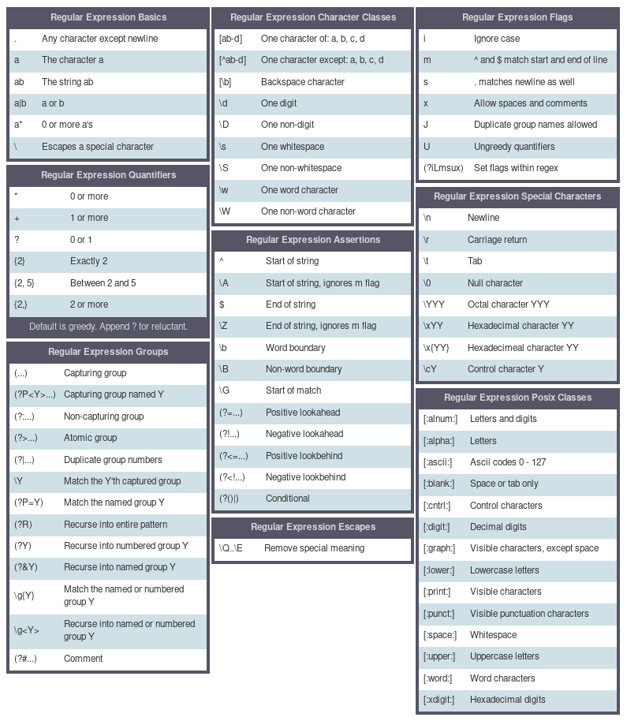

\pagebreak

Za izradu vježbi koristimo interaktivni regex simulator. Ako na LV računaru
imate internet otvorite sljedeći link:
[https://regex101.com](https://regex101.com). Za pokretanje regex101 lokalno (u
slučaju da internet nije dostupan) pokrenuti fet-base kontejner, navigirati u
direktorij sa pripremom za vježbe i pokrenuti skriptu `run_local.sh` i navigirati
na [https://localhost:8000](https://localhost:8000).

Odabrati PCRE (PHP) sintaksu regularnih izraza!

\pagebreak

### Regex cheat sheet


\pagebreak


### Zadatak 1.
Napisati regularni izraz koji matchira heksadecimalne brojeve.
Primjeri ulaza:
```
0x0
0x1234
0xabcdef
0xca11ab1e

208
0xtar
```

### Zadatak 2.
Napisati regularni izraz koji matchira validne identifikatore prema C/CPP programskom
jeziku.
Primjeri ulaza:
```
mojInteger
index21
foo_
_bar
_bar42

10ducks
page-break
```

### Zadatak 3.
Napisati regularni izraz koji matchira decimalne brojeve.
Primjeri ulaza:
```
0
1
12
+10
-200
401.5
+12.615
-4.5e10
+12.515E-8

25+1.2
100.3.5
-1.-5e10
```

### Zadatak 4.
Napisati regularni izraz koji matchira brojeve telefona.
Primjeri ulaza:
```
061123456
061-123-456
066 123 456
+38762123456
+387-66-423-156
+387 66 423 156
```

### Zadatak 5.
Dat je dio html koda sa neke stranice. Napisati regularni izraz koji će pronaći
http linkove unutar html koda. Dovoljno je naći linkove koji se nalaze pod href
tagom.

\footnotesize
\pagebreak
``` html
<div class="portal" role="navigation" id='p-navigation'>
<h3>Navigation</h3>
<div class="body">
<ul>
 <li id="n-mainpage-description">
   <a href="/wiki/Main_Page" title="Visit the main page [z]" accesskey="z">Main page</a></li>
 <li id="n-contents">
   <a href="/wiki/Portal:Contents" title="Guides to browsing Wikipedia">Contents</a></li>
 <li id="n-featuredcontent">
   <a href="/wiki/Portal:Featured_content" title="Featured content  the best of Wikipedia">
      Featured content</a></li>
 <li id="n-currentevents">
   <a href="/wiki/Portal:Current_events" title="Find background information on current events">
      Current events</a></li>
 <li id="n-randompage">
   <a href="/wiki/Special:Random" title="Load a random article [x]" accesskey="x">Random article
   </a></li>
 <li id="n-sitesupport">
   <a href="//donate.wikimedia.org/wiki/Special:Fundraiser?uselang=en" title="Support us">
      Donate to Wikipedia</a></li>
</ul>
</div>
</div>
```

### Grep

`grep` je CLI alat za pretragu saržaja fileova na file sistemu.
Spremiti gornji html kao file i pokrenuti komandu:

```
grep -P 'href=".*"' index.html
```

ili

```
grep -P 'href=".*"' -R .
```

\pagebreak


[Source xkcd 208](https://xkcd.com/208/)

